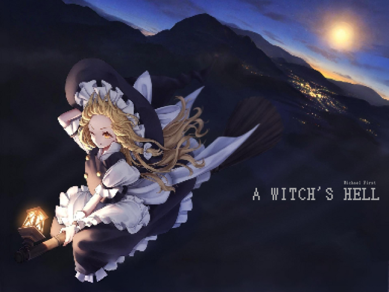
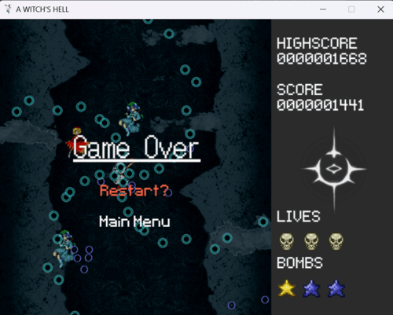
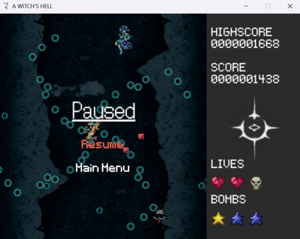
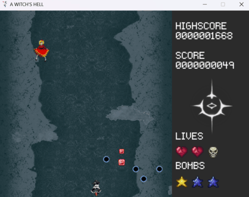
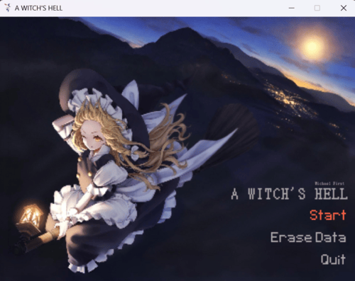

# A Witch’s Hell

A bullet-hell game developed in Python 2, 3, and PyGame, created for an Algorithm and Programming assignment in BINUS University International Class.

# Screenshots

# Dependencies
- Python 2
- Python 3
- PyGame

# Installation
- Download this file as a Zip
- Extract it to a desired location
- Open the folder as a directory
- Run 'main.py'

# Controls
- **Z**: Fire and select options.
- **X**: Use a bomb, canceling nearby projectiles.
- **Left Shift**: Slow down movement for precision.

# Tips and Tricks

- **Master the Mechanics**: Knowing the hitbox is key—visualize your weak point.
- **Use Focus Mode Wisely**: Activate in tight situations to move with precision, but switch to fast movement for quick pickups.
- **Bomb Strategically**: Use bombs only when you're about to get hit. They serve as an extra life if used effectively.
- **Embrace the Challenge**: Remember, this is a bullet hell game. Dodge, focus, and have fun!

# Features
- **Bullet Hell Mechanics**: Touhou-style gameplay, one-hit small hitbox, and heavy bullet patterns.
- **Endless Survival Mode**: Difficulty increases over time.
- **Frame-Based Mechanics**: Bullet patterns are calculated in degrees.
- **Enhanced Features**: Accurate bomb hitboxes, bullet grazing, difficulty progression with new enemies, and highscore persistence with reset options.
- **Multiple Fire Types**: Distinct player fire modes for different enemy scenarios.
- **Full Animation and Sound Effects**.

## Tutorial

## Menu Options
Navigate with arrow keys; press **Z** to select:
- **Main Menu**: Start Game, Erase Data (reset highscore), Quit
- **Pause Menu (ESC)**: Resume Game, Return to Main Menu
- **Game Over Menu**: Restart Game, Return to Main Menu

## Movement
- **Arrow Keys**: Quick movements for dodging.
- **Left Shift**: Enter Focused Mode for slower, precise movement.

## Game Mechanics
- **Lives**: Two initial lives, with chances for more through pink star drops.
- **Bombs**: One per life, replenished by gray star drops.
- **Fire Modes**: Default mode for spread damage, Focus Mode for concentrated fire.

## Scoring System
- **Enemy Kills**: Points vary by enemy type.
- **Item Drops**: Points for collecting items, with life and bomb caps converting to points.
- **Grazing Bullets**: Near-misses grant points for added risk.

## Increasing Difficulty
- The game grows harder over time with faster spawn rates and more advanced enemies. Difficulty tiers escalate every 30 seconds to 5 minutes with new enemy types and patterns.

# Important Notes
All images and sounds are credited to their respective creators.

# File Descriptions
- **Main-Menu Music**: "Bad Apple" - Touhou Music
- **In-Game Music**: Includes tracks like "It's Going Down Now" (Persona 3 Reload), "Young Girl A" (Siinamota) and "Kingslayer" (Bring Me The Horizon feat. BabyMetal)
- **Assets**: Sound effects and sprites sourced from Project Touhou and Terraria's Calamity Mod

# BEWARE. THE GAME IS AT ITS HARDEST DIFFICULTY ONCE "KINGSLAYER" PLAYS
